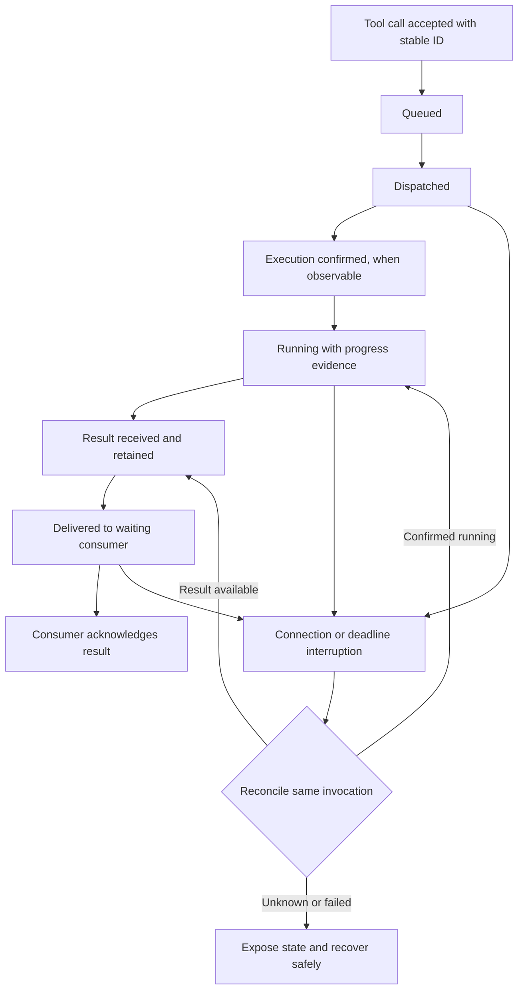
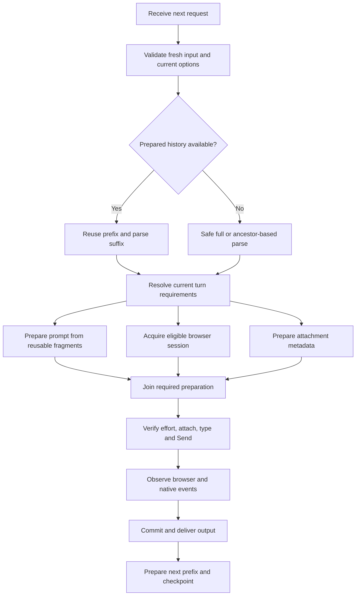

# Codex ChatGPT Web — Consolidated Modification and Optimization Report

**Date:** 2 October 2026  
**Repository:** https://github.com/EmpRider/codex-chatgpt-web  
**Evidence baseline:** v6.2.7, commit `22b93ed743e4f9842bc6f9af83c97d096b2bb3f4`  
**Status:** Proposed modifications consolidated from our source review and subsequent discussion. No implementation, merge, release, or new performance benchmark is claimed by this report. The repository must be checked for subsequent changes before implementation.

## 1. Goals and conclusions

The application needs two coordinated improvements:

1. **Reliable continuation:** long-running tools and interrupted result delivery should not unnecessarily terminate the whole conversation.
2. **Lower latency and memory use:** avoid rebuilding unchanged history, repeating browser interactions, and waiting for optional work on the request path.

The user’s target is for a submitted task to start and begin meaningful response within one minute. Treat this as an acceptance target under defined test conditions, not a guarantee against upstream model queues or slow external tools. Near-zero local overhead is a direction; near-zero end-to-end latency is not realistic.

Prioritize native-tool reliability first, then browser submission overhead and reusable conversation state. Increasing every timeout or wrapping synchronous work in `async` does not resolve the underlying issues.

## 2. Existing behavior to preserve

The reviewed code already includes useful optimizations. Extend these instead of building parallel replacements:

- Previous-response history is normally retrieved from a process memory map after a one-time lazy disk load.
- Responses state persistence is already debounced, asynchronous, atomic, bounded and coalesced.
- Token estimates are cached within each request; the tokenizer is reused within the process.
- DOM mutation observation and revision-based snapshot reuse already exist.
- Browser helper reuse, retained browser sessions, routing leases, managed-module caching and context chunk offset caching already exist.
- Transport heartbeats already exist. They prove connection activity, not completion of a tool.
- Invocation fingerprinting and late-result handling already provide parts of recovery. Review and extend their scope rather than assuming no protection exists.
- Lifecycle diagnostics use a bounded asynchronous writer on non-Windows systems, with a Windows-specific synchronous path.

## 3. Complete modification backlog

**P0:** interruption/correctness. **P1:** main latency and memory improvements. **P2:** supporting improvements. **P3:** tail-latency refinements. All entries below are proposed, with exact implementation dependent on current source and protocol capabilities.

### A. Native-tool execution and result delivery

A native-tool result is the output of a command, file operation or connector tool executed by Codex and returned through the bridge to the model.

| ID | Priority | Modification | Required behavior / acceptance evidence |
|---|---|---|---|
| R01 | P0 | Correlate every handoff | Request, turn, batch, call and attempt IDs connect queueing, delivery, execution evidence, result receipt and acknowledgement. Logs identify the stage where progress stopped. |
| R02 | P0 | Track each tool independently | Maintain per-call state inside a batch. Preserve completed results while another call is pending. Do not mark a whole batch complete prematurely. |
| R03 | P0 | Separate queue and execution deadlines | Queue waiting, dispatch acknowledgement, execution and result delivery have distinct budgets. If execution-start evidence is unavailable, record that uncertainty rather than infer it. |
| R04 | P0 | Coordinate deadline contracts | Review the 150-second native-result deadline, MCP request lifetime and supported long waits together. A shorter transport deadline must not silently invalidate an otherwise valid operation. |
| R05 | P0 | Use genuine progress evidence | Distinguish tool output/start/completion from browser mutations and transport heartbeats. Progress may refresh inactivity allowance, subject to an overall execution limit. |
| R06 | P0 | Retain results until acknowledged | Extend existing result handling with bounded result retention and explicit consumption state. Re-delivery is idempotent. Persist only the state needed if recovery across process restarts is supported. |
| R07 | P0 | Reconcile interruptions | On reconnect, query the same invocation and recover known results. Unknown execution outcomes remain explicit; never blindly rerun an operation that could have already changed something. |
| R08 | P1 | Add asynchronous jobs where supported | Long operations can return an accepted job ID, then provide status and the final result. Requires bridge/caller/executor protocol support; a job ID is not a substitute for the tool’s final output. |
| R09 | P0 | Make cancellation and cleanup explicit | Propagate cancellation where supported, retain late-result reconciliation and reject stale results from another turn. Preserve a usable conversation when recovery is possible; expose an actionable failure otherwise. |

### B. Conversation preparation, caching and memory

| ID | Priority | Modification | Required behavior / acceptance evidence |
|---|---|---|---|
| C01 | P1 | Prepare normalized conversation prefixes | After each committed Responses output, including tool-call responses, prepare reusable parsed state. Next request parses only new input and current options. |
| C02 | P1 | Use shared history blocks or parent-plus-delta records | Reduce repeated full-history arrays and serialization. Bound parent depth through checkpoints; eviction cannot break live descendants. |
| C03 | P1 | Make state accounting incremental | Avoid full synchronous JSON serialization solely to measure every growing response. Document byte-accounting accuracy and enforce memory limits. |
| C04 | P2 | Maintain a tool-call index | Resolve result call IDs using an incrementally maintained lookup while preserving existing namespace and duplicate-ID behavior. |
| C05 | P1 | Cache canonical prompt fragments | Reuse unchanged normalized message representations and sanitized serialization. Current tools, output contract, transport and fresh capability handles remain dynamic. |
| C06 | P1 | Extend token caching across turns | Cache unchanged content with tokenizer/version identity and a byte cap. Preserve correct or conservative token budgets at concatenation boundaries. |
| C07 | P2 | Cache immutable attachment/context preparation | Reuse hashes, stable byte metadata and chunk boundaries. A cached file is not evidence that it is uploaded into the current browser document. |
| C08 | P2 | Share validated environment/configuration state | Avoid per-request synchronous loading and unchanged writes. Invalidate on path/revision/authority changes; current tools and permissions are never inherited blindly. |
| C09 | P2 | Cache compiled output validators | Reuse AJV compilation by schema and validator options/version. Preserve current format names and isolate validation error reporting. |

### C. Browser, optional services and request flow

| ID | Priority | Modification | Required behavior / acceptance evidence |
|---|---|---|---|
| B01 | P1 | Make model/effort selection idempotent | Select before prompt entry. Reuse page-scoped verified state; a cheap fresh check precedes Send. Reopen menus only when state is wrong or uncertain. |
| B02 | P1 | Reduce blocking diagnostics | Keep cheap stage events. Sample expensive success captures and capture faults fully. Snapshot evidence before the page changes; process and write it afterward. |
| B03 | P2 | Refine event-driven response extraction | Extend existing mutation observers with relevant dirty-subtree extraction and event coalescing. Reattach after remount/navigation; preserve completion checks. |
| B04 | P1 | Overlap independent preparation | Once current requirements are known, overlap pure prompt preparation, eligible session acquisition and immutable attachment preparation. Serialize mutations of the same browser page. |
| B05 | P2 | Bound background preparation | Use immutable snapshots, bounded queues, shared in-flight jobs, revision checks and cancellation of obsolete derived work. New requests take precedence over idle work. |
| B06 | P2 | Bound and reuse optional optimizer work | Reuse valid route leases, prewarm infrastructure, and give optional routing/compression a combined deadline. Cache derived compression only with its relevant inputs and preserve originals. |
| B07 | P2 | Simplify static system-prompt content | Remove duplicated rules and unnecessary always-on policy sections. Keep transport, instruction priority, tool and completion semantics intact. Cache assembly separately from reducing model-visible tokens. |
| B08 | P3 | Move optional final bookkeeping off the visible path | Defer accounting and physical cleanup after committed completion when safe. Do not release an active page, abandon persistence requirements or acknowledge uncommitted output. |

**Total: 26 proposed modifications.** Several should be implemented together because they share state or protocol changes.

## 4. Proposed native-tool lifecycle

For tools that do not expose start/progress events, retain a dispatched/waiting state and enforce a bounded wait. Do not fabricate execution progress. Per-call tracking can improve diagnosis and retention even when the downstream protocol requires all results to be delivered as a batch.

### Deadline and retry policy

| Condition | Proposed handling |
|---|---|
| Waiting for an execution slot | Queue deadline and queued status; do not claim execution started. |
| Long-running tool with genuine progress | Refresh inactivity allowance within the operation’s overall limit. |
| Tool with no intermediate progress capability | Use an appropriate bounded execution policy; silence alone is inconclusive. |
| Only heartbeat traffic continues | Keep connection status healthy, but do not treat it as tool progress. |
| Transport closes while operation continues | Reconcile using the same invocation ID; await/retrieve rather than start a duplicate. |
| Result exists but acknowledgement is lost | Redeliver idempotently and acknowledge once consumed. |
| Outcome is unknown for a side-effecting operation | Do not automatically re-execute; inspect status or require an explicit recovery decision. |
| User cancels | Propagate cancellation and reconcile races with completion. Cancellation request is not proof execution stopped. |

Do not invent universal timeout values before observing tool durations and protocol limits. Configure separate policies for queueing, execution, inactivity and delivery, with visible reasons for expiration.

## 5. Proposed fast request path

The next request must not block indefinitely behind an idle-time preparation job. Reuse a ready ancestor, parse the missing suffix or fall back safely. A cache miss affects speed, not correctness.

### Data that can be prepared versus data that must remain fresh

| Reusable / preparable | Fresh for each request or submission |
|---|---|
| Immutable normalized prior messages | New user input and new tool outputs |
| Historical call-ID index and parser boundary state | Current advertised tools, permissions and options |
| Versioned static policy fragments | Current model/effort and applicable output format |
| Stable serialized messages and token estimates | Fresh turn capability handles and ownership checks |
| Compiled schema validators keyed by exact schema | Current schema selection and validation result |
| Content-addressed attachment metadata | Current browser upload receipt and page state |
| Validated configuration snapshot | Configuration changes and service readiness failures |

Parser reuse must preserve pending reasoning, the last assistant-message boundary, loaded tool specifications, raw replay-prefix length and compaction lineage. Compression must create a derived projection rather than mutate shared original history.

## 6. Source locations and implementation boundaries

Source links are pinned to the audited commit so this report remains reproducible.

| Area | Primary source |
|---|---|
| Native-result lifecycle and timeout | [turn-execution.ts](https://github.com/EmpRider/codex-chatgpt-web/blob/22b93ed743e4f9842bc6f9af83c97d096b2bb3f4/src/adapters/chatgpt-web/turn-execution.ts) and its broker/MCP/server callers |
| Response history and persistence | [state.ts](https://github.com/EmpRider/codex-chatgpt-web/blob/22b93ed743e4f9842bc6f9af83c97d096b2bb3f4/src/responses/state.ts) |
| Parsing and tool association | [parser.ts](https://github.com/EmpRider/codex-chatgpt-web/blob/22b93ed743e4f9842bc6f9af83c97d096b2bb3f4/src/responses/parser.ts) |
| Prompt compilation | [prompt.ts](https://github.com/EmpRider/codex-chatgpt-web/blob/22b93ed743e4f9842bc6f9af83c97d096b2bb3f4/src/adapters/chatgpt-web/prompt.ts) |
| Token estimation | [token-estimate.ts](https://github.com/EmpRider/codex-chatgpt-web/blob/22b93ed743e4f9842bc6f9af83c97d096b2bb3f4/src/lib/token-estimate.ts) |
| Browser selection and observation | [browser-worker.ts](https://github.com/EmpRider/codex-chatgpt-web/blob/22b93ed743e4f9842bc6f9af83c97d096b2bb3f4/src/adapters/chatgpt-web/browser-worker.ts) |
| Per-request orchestration and completion | [index.ts](https://github.com/EmpRider/codex-chatgpt-web/blob/22b93ed743e4f9842bc6f9af83c97d096b2bb3f4/src/adapters/chatgpt-web/index.ts) |
| Environment and schema reuse | `src/adapters/chatgpt-web/thread-environment.ts`, `output-validation.ts` |
| Attachments and diagnostics | `src/adapters/chatgpt-web/skill-attachments.ts`, `turn-diagnostics.ts`, browser capture paths |
| Configuration, routing and compression | `src/optimization/config.ts`, `jev.ts`, `headroom.ts`, `tool-results.ts` |

A complete asynchronous job lifecycle cannot necessarily be implemented only inside this fork. Verify what Codex and the MCP caller can expose and consume. If neither provides execution-start events or job-status support, retain compatibility and improve local correlation, bounded waiting and result reconciliation first. No changes to Codex itself are assumed or authorized by this report.

## 7. Delivery sequence

| Phase | Included work | Completion gate |
|---|---|---|
| 1 — Establish evidence | R01 and timing instrumentation | A failed call can be traced to queue, dispatch, execution evidence, return or delivery. |
| 2 — Prevent avoidable interruption | R02–R07, R09 | Long/partial batches, disconnects, late results and cancellation recover correctly without duplicate side effects. |
| 3 — Reduce submission overhead | B01–B02, C08–C09 | Correct effort selected before typing; fewer menu interactions and blocking captures; fresh configuration respected. |
| 4 — Reuse conversation work | C01–C07, B05 | Cached and uncached parsing agree; long histories have bounded memory and less repeated work. |
| 5 — Add safe concurrency and optional-service improvements | B03–B04, B06–B08 | Lower measured preparation time without UI races, stale output or background contention. |
| 6 — Extend long-job protocol | R08 where supported | Accepted jobs, reconnect, cancellation and final delivery work end-to-end with existing clients. |

Keep changes in reviewable increments and make new caching/concurrency paths independently reversible. Reliability changes must preserve current transport semantics until both ends support a new protocol.

## 8. Verification and release criteria

### Reliability scenarios

- Mixed batch: fast Git command plus slow external search; completed results remain intact.
- Operation exceeds the former fixed batch window while genuinely progressing; no premature whole-session failure under the configured execution policy.
- Dispatch fails before execution; failure differs from a lost response after execution.
- Connection closes before result delivery and after delivery but before acknowledgement.
- Duplicate deliveries, out-of-order returns, late results and cancellation/completion races.
- A side-effecting operation has an unknown outcome; recovery does not execute it a second time automatically.
- Process restart, if durable recovery is claimed; unsupported restart recovery is explicitly surfaced.
- Heartbeats continue while execution is stalled; the overall watchdog still terminates or escalates appropriately.

### Correctness and performance scenarios

- Warm/cold startup, long histories, many tool calls and immediate tool continuations.
- Reasoning blocks, tool search, current-tool changes, branching and compaction.
- Cache misses, eviction, stale revisions, corrupt checkpoints and background jobs finishing out of order.
- Model/effort changes, manual UI changes, browser remounts and navigation.
- Inline and multipart/MCP context delivery, attachments and structured output.
- Windows-specific filesystem, process, pipe and diagnostic behavior; a Linux-only pass is insufficient for the user’s Windows environment.
- Optimizers unavailable or slow; optional work stays within its budget and preserves usable fallback behavior.

### Measurements

Record request acknowledgement, queue time, preparation, browser Send acceptance, first meaningful model output, per-tool queue/execution/return/delivery, final completion, p50/p95, cache hit rate, event-loop delay, retained bytes and peak memory. Measure realistic sequential sessions long enough to expose growth.

Acceptance requires improvement against the same baseline workload, no correctness regression, no duplicate execution in injected transport-failure tests, bounded cache/background state, and transparent errors when recovery is impossible. Report upstream waiting separately. An SSE heartbeat or “accepted” message does not count as the model doing useful work.

## 9. What this report does not promise

Caching does not fix missing tool delivery by itself. DOM observers cannot replace watchdogs. More generous deadlines cannot prove that execution is healthy. Static application prompt caching does not automatically reduce model-visible tokens. Async syntax does not move CPU work off the event loop.

The recommended result is a faster request path with reusable state and a recoverable tool lifecycle, backed by measurements rather than a promise of zero latency.
